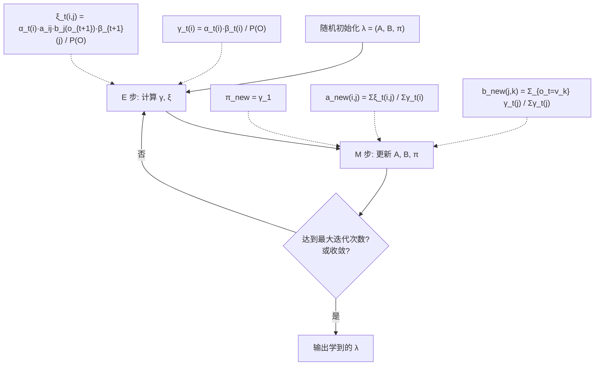

The user is asking about the three classic problems of HMM (Hidden Markov Model). This is a theoretical question, and I can answer it from my knowledge. But let me also check the other files in the 11hmm directory to see if there are implementations related to these three problems, which would help me provide a more contextualized answer.
Now I have a comprehensive view of all the HMM files. Let me explain the three classic problems of HMM, tying them to the implementations in the user's codebase.
## HMM 的三个经典问题

HMM（隐马尔可夫模型）的三个经典问题由 Rabiner 在 1989 年的经典论文中系统总结。你的 `11hmm/` 目录中**每个文件都对应其中一个问题**：

---

### 基本符号约定

| 符号 | 含义 |
|---|---|
| \(Q = \{q_1, q_2, \ldots, q_N\}\) | 隐状态集合（如：晴/阴/雨） |
| \(V = \{v_1, v_2, \ldots, v_M\}\) | 观测值集合（如：散步/购物/打扫） |
| \(A\) | 状态转移概率矩阵，\(a_{ij} = P(q_t = j \mid q_{t-1} = i)\) |
| \(B\) | 发射概率矩阵，\(b_j(k) = P(o_t = v_k \mid q_t = j)\) |
| \(\pi\) | 初始状态概率向量，\(\pi_i = P(q_1 = i)\) |
| \(\lambda = (A, B, \pi)\) | **模型参数** |
| \(O = o_1, o_2, \ldots, o_T\) | 观测序列 |

---

### 问题一：概率计算问题（Evaluation）

> **已知** 模型 \(\lambda = (A, B, \pi)\) 和观测序列 \(O\)，**求** \(P(O \mid \lambda)\)

#### 通俗理解

> "给定一个 HMM 模型，某个观测序列出现的概率有多大？"

#### 对应代码：`2forward.py` 和 `3backward.py`

两种等价算法：


#### 应用场景
- 在多个候选模型中，选择最匹配观测序列的那个（语音识别中的声学模型打分）

---

### 问题二：预测问题 / 解码问题（Decoding）

> **已知** 模型 \(\lambda = (A, B, \pi)\) 和观测序列 \(O\)，**求** 最可能的隐状态序列 \(I^* = \arg\max_I P(I \mid O, \lambda)\)

#### 通俗理解

> "给定观测序列，背后最有可能的状态变化路径是什么？"

#### 对应代码：`approximate.py` 和 `viterbi.py`

两种算法：

| 算法 | 文件 | 策略 | 是否全局最优 |
|---|---|---|---|
| **近似算法** | `approximate.py` | 每个时刻独立选 \(\max \gamma_t(i)\) | 否（近似） |
| **Viterbi 算法** | `viterbi.py` | 动态规划，全局最优路径 | 是（精确） |

**近似算法**的核心思路：

```python
# 先算前向概率 alpha，再算后向概率 beta
# 每个时刻独立选概率最大的状态
gamma_t(i) = alpha[t][i] * beta[t][i]   # t 时刻处于状态 i 的概率
```

**Viterbi 算法**的核心思路（动态规划）：

```python
# δ_t(i) = max_{路径} P(o₁..o_t, q₁..q_{t-1}, q_t=i | λ)
# ψ_t(i) = argmax δ_{t-1}(j) · a_{ji}    # 记录回溯路径
```


#### 应用场景
- 中文分词、词性标注、命名实体识别
- 基因序列分析（寻找编码区）

---

### 问题三：学习问题（Learning）

> **已知** 观测序列 \(O\)，**求** 模型参数 \(\lambda^* = \arg\max_\lambda P(O \mid \lambda)\)

#### 通俗理解

> "只有观测数据，如何自动学到 HMM 的参数？"

#### 对应代码：`4baumWelch.py`

使用 **Baum-Welch 算法**（EM 算法在 HMM 上的特化）：



**E 步**：用当前参数算期望

```python
# gamma[t][i]: t 时刻处于状态 i 的概率
lst[i] = alpha[t][i] * beta[t][i] / sum_
# xi[t][i][j]: t 时刻从状态 i 转移到 j 的概率
lst[i][j] = alpha[t][i] * a[i][j] * b[j][sequence[t+1]] * beta[t+1][j] / sum_
```

**M 步**：用期望更新参数

```python
# 新的转移概率 = 从 i→j 的期望次数 / 处于 i 的期望次数
new_a[i][j] = Σ ξ_t(i,j) / Σ γ_t(i)
# 新的发射概率 = 在状态 j 观测到 k 的期望次数 / 处于 j 的期望次数
new_b[j][k] = Σ_{o_t=k} γ_t(j) / Σ γ_t(j)
```

#### 应用场景
- 语音识别中从语音数据训练声学模型
- 手势识别、行为建模

---

### 总结：三个问题与你的代码对应关系

```
问题一（概率计算）→ 2forward.py（前向算法）
                  → 3backward.py（后向算法）

问题二（预测解码）→ approximate.py（近似算法）
                  → viterbi.py（Viterbi 算法，待完善）

问题三（参数学习）→ 4baumWelch.py（Baum-Welch 算法）
                  → 5forwardBackwardBaumWelch.py（前向-后向版本的 Baum-Welch）
```

注意问题一和问题三的**依赖关系**：问题三（Baum-Welch）的 E 步内部就**调用了问题一的前向和后向算法**来计算 \(\alpha\) 和 \(\beta\)。同时，问题二的近似算法也依赖前向和后向概率。所以**前向和后向算法是 HMM 的基石**。