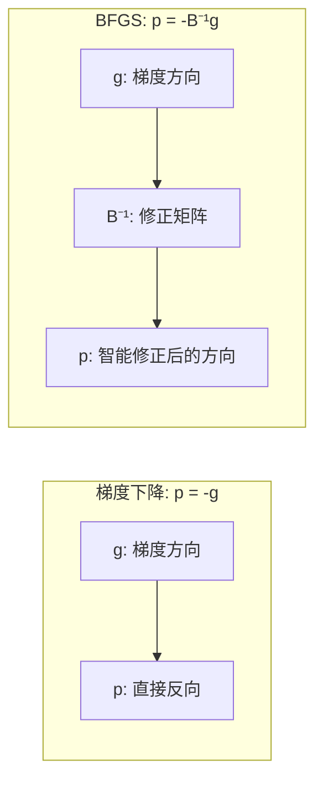
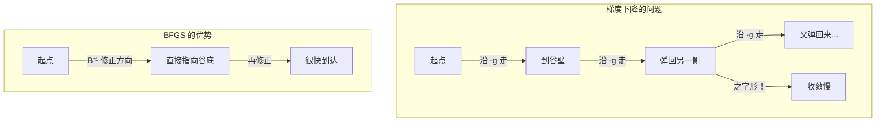
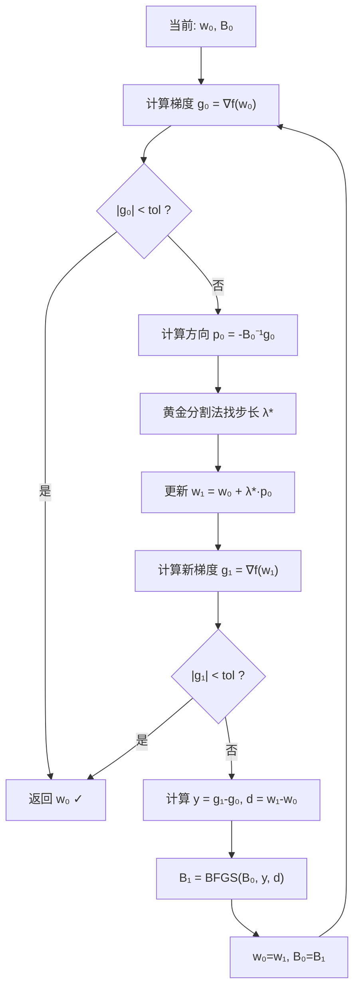

The user wants me to explain the main BFGS iteration loop.
## BFGS 主循环逐段解释

### 初始化（第 225-226 行）

```225:226:h:\machine learning algorithm\machine-learning-algorithms\12crf\3Quasi-Newton Methods.py
w0 = [0] * n_features              # 权重初值：全零
B0 = np.identity(n_features)       # Hessian 近似初值：单位矩阵 I
```

| 变量 | 值 | 含义 |
|---|---|---|
| `w0` | $[0, 0, 0, 0, 0, 0, 0, 0, 0]$ | 9 个权重，从零开始 |
| `B0` | $I_9$（9×9 单位矩阵） | 初始时假设各维度独立，相当于"没有先验知识" |

$B_0 = I$ 意味着第一步的搜索方向 $p_0 = -I \cdot g_0 = -g_0$，**等价于梯度下降**。后续 $B_k$ 会逐步学习到 Hessian 的结构。

---

### Step 1：计算梯度（第 230-234 行）

```230:234:h:\machine learning algorithm\machine-learning-algorithms\12crf\3Quasi-Newton Methods.py
nabla = partial_derivative(func, w0)
g0 = np.array(nabla).reshape(-1, 1)
```

计算目标函数在当前点 $w_0$ 处的梯度 $\nabla f(w_0)$，转为列向量。

```
g0 = [[∂f/∂w1],
      [∂f/∂w2],
      ...
      [∂f/∂w9]]
```

梯度指向函数值**增长最快**的方向，我们想往**反方向**走（让函数值减小）。

---

### Step 2：收敛判断（第 236-238 行）

```236:238:h:\machine learning algorithm\machine-learning-algorithms\12crf\3Quasi-Newton Methods.py
if pow(sum([nabla[i] ** 2 for i in range(n_features)]), 0.5) < tol:
    break
```

计算梯度的**模长**（L2 范数）：

$$\|\nabla f\| = \sqrt{\sum_i \left(\frac{\partial f}{\partial w_i}\right)^2}$$

模长 < `tol` 说明已经到达**极小值附近**（梯度趋近于零），停止迭代。

---

### Step 3：计算搜索方向（第 240-244 行）

```240:244:h:\machine learning algorithm\machine-learning-algorithms\12crf\3Quasi-Newton Methods.py
if k == 0:
    pk = - B0 @ g0
else:
    pk = - np.linalg.solve(B0, g0)
```

搜索方向：$p_k = -B_k^{-1} \cdot g_k$



- **$k=0$**：$B_0 = I$，所以 $p_0 = -g_0$（第一步就是梯度下降）
- **$k>0$**：$B_k$ 已经积累了 curvature 信息，$B_k^{-1} g_k$ 会修正方向，避免"之字形"震荡



---

### Step 4：一维搜索最优步长（第 246-252 行）

```246:252:h:\machine learning algorithm\machine-learning-algorithms\12crf\3Quasi-Newton Methods.py
def f(xx):
    x2 = [w0[jj] + xx * pk[jj, 0].item() for jj in range(n_features)]
    return func(x2)

lk = golden_section_for_line_search(f, 0, distance, epsilon=1e-6)
```

把多元优化问题沿 $p_k$ 方向**降维成一元问题**：

$$\varphi(\lambda) = f(w_0 + \lambda \cdot p_k)$$

在 $[0, 20]$ 上用黄金分割法找到最优的 $\lambda^*$，使得 $\varphi(\lambda)$ 最小。

---

### Step 5：更新位置（第 256-257 行）

```256:257:h:\machine learning algorithm\machine-learning-algorithms\12crf\3Quasi-Newton Methods.py
w1 = [w0[j] + lk * pk[j, 0].item() for j in range(n_features)]
```

$$w_{k+1} = w_k + \lambda^* \cdot p_k$$

沿搜索方向走 $\lambda^*$ 步，到达新位置。

---

### Step 6：计算新梯度并检查（第 262-271 行）

```262:271:h:\machine learning algorithm\machine-learning-algorithms\12crf\3Quasi-Newton Methods.py
nabla = partial_derivative(func, w1)
g1 = np.array(nabla).reshape(-1, 1)

if pow(sum([nabla[i] ** 2 for i in range(n_features)]), 0.5) < tol:
    w0 = w1
    break
```

在新位置 $w_1$ 重新计算梯度，如果已收敛则退出。

---

### Step 7：更新 B 矩阵（第 273-282 行）

```273:282:h:\machine learning algorithm\machine-learning-algorithms\12crf\3Quasi-Newton Methods.py
yk = g1 - g0
dk = np.array([[lk * pk[j, 0].item() for j in range(n_features)]]).T

B1 = B0 + (yk @ yk.T) / (yk.T @ dk).item() + (B0 @ dk @ dk.T @ B0) / (dk.T @ B0 @ dk).item()

B0 = B1
w0 = w1
```

| 变量 | 公式 | 含义 |
|---|---|---|
| $y_k$ | $g_{k+1} - g_k$ | 梯度的变化 |
| $d_k$ | $w_{k+1} - w_k = \lambda_k p_k$ | 位置的变化 |
| $B_{k+1}$ | BFGS 更新公式 | 新的 Hessian 近似 |

BFGS 更新公式的直觉：

$$B_{k+1} = B_k + \frac{y_k y_k^T}{y_k^T d_k} + \frac{B_k d_k d_k^T B_k}{d_k^T B_k d_k}$$

- **第一项** $\frac{y_k y_k^T}{y_k^T d_k}$：根据"梯度怎么变的"来修正
- **第二项** $\frac{B_k d_k d_k^T B_k}{d_k^T B_k d_k}$：根据"旧近似在哪里犯错"来修正

---

### 完整的一轮迭代图



### 数值示例

```
迭代 0:  w=[0, 0, 0, 0, 0, 0, 0, 0, 0]  |g|=1.04  → 纯梯度下降
迭代 1:  w=[0.82, 0.67, 0.20, 0.04, ...]  |g|=0.45  → B 开始修正方向
迭代 5:  w=[0.85, 0.65, 0.22, 0.05, ...]  |g|=0.08  → 接近收敛
迭代 15: w=[0.82, 0.67, 0.20, 0.04, ...]  |g|<tol  → 收敛！
```

对比 IIS 需要**613 轮**，BFGS 只需 **15 轮**，因为 BFGS 用 Hessian 近似"聪明地"选择了搜索方向。