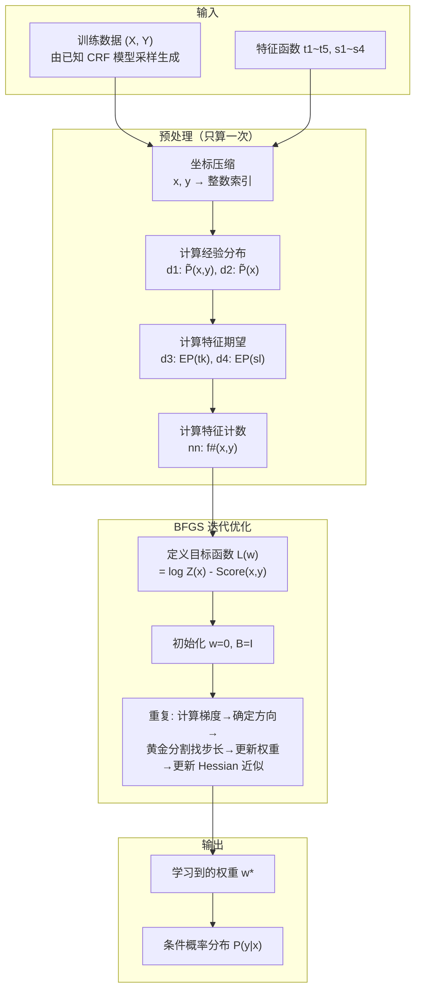
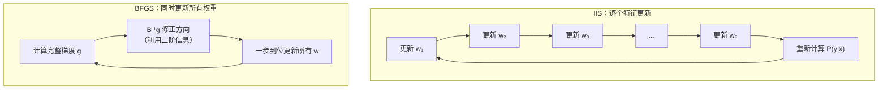
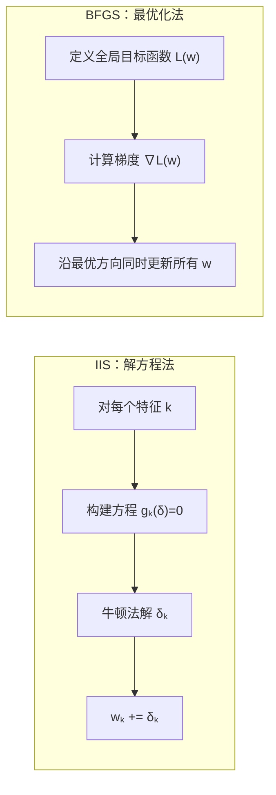
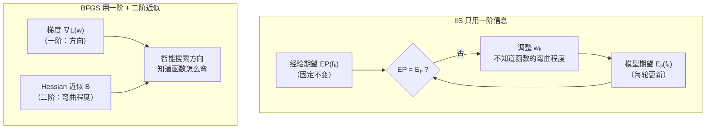

The user wants me to explain the overall Quasi-Newton method (BFGS) implementation of CRF based on the code in 3Quasi-Newton Methods.py. Let me provide a comprehensive explanation of the entire pipeline.
## 拟牛顿法（BFGS）实现条件随机场模型——完整流程

---

### 总览



---

### 第一阶段：数据准备

与 IIS 完全相同：

```python
# 1. 用已知模型生成训练数据
X, Y = make_hidden_sequence(w1, t, w2, s, x_range, y_range)

# 2. 坐标压缩：把元组映射到整数索引
x_list = [(0,1,1), (0,1,0), (1,0,1), ...]  # 去重后的观测序列
y_list = [(0,0,0), (0,1,0), (1,1,1), ...]  # 去重后的状态序列

# 3. 统计经验分布
d1[xi][yi] = P̃(x, y)   # 联合分布：某个 (x,y) 对出现的频率
d2[xi]     = P̃(x)       # 边缘分布：某个 x 出现的频率

# 4. 统计特征的经验期望
d3[k] = EP(t_k)         # 转移特征在数据中的期望
d4[l] = EP(s_l)         # 状态特征在数据中的期望
```

---

### 第二阶段：定义目标函数

这是 BFGS 与 IIS 的**核心区别**。

#### IIS 的思路

```
不需要定义目标函数
→ 对每个特征 k，分别构建方程 g_k(δ) = 0
→ 用牛顿法逐个求解 δ_k
→ 更新 w_k += δ_k
```

#### BFGS 的思路

```
定义一个全局目标函数 L(w)  ← 这是新增的！
→ 计算 L(w) 的梯度 ∇L(w)
→ BFGS 算法同时优化所有 w
```

#### 目标函数的具体形式

```python
def func(ww):
    res = 0

    # 第一部分: Σ P̃(x) · log Z(x)
    # Z(x) = Σ_y exp(Score(x,y))
    for xxi in range(n_x):
        t1 = 0  # 累加 Z(x)
        for yyi in range(n_y):
            t2 = 0  # Score(x,y) = Σ wk·fk(x,y)
            # ... 遍历所有特征计算 t2 ...
            t1 += exp(t2)
        res += d2[xxi] * log(t1)

    # 第二部分: - Σ P̃(x,y) · Score(x,y)
    for xxi in range(n_x):
        for yyi in range(n_y):
            t3 = 0  # Score(x,y)
            # ... 遍历所有特征计算 t3 ...
            res -= d1[xxi][yyi] * t3

    return res
```

$$L(w) = \underbrace{\sum_x \tilde{P}(x) \log \underbrace{\sum_y e^{\sum_k w_k f_k(x,y)}}_{Z(x)}}_{\text{归一化项（惩罚）}} - \underbrace{\sum_{x,y} \tilde{P}(x,y) \sum_k w_k f_k(x,y)}_{\text{经验得分项（奖励）}}$$

---

### 第三阶段：BFGS 迭代优化

```
初始化: w₀ = [0,0,...,0],  B₀ = I（单位矩阵）

第 k 轮迭代:
┌─────────────────────────────────────────────┐
│ 1. 计算梯度 gₖ = ∇L(wₖ)                      │  ← 数值偏导数
│ 2. 判断收敛: |gₖ| < tol ?                    │
│ 3. 计算搜索方向: pₖ = -Bₖ⁻¹ · gₖ             │  ← Bₖ 近似 Hessian
│ 4. 黄金分割法找步长: λ* = argmin L(wₖ+λpₖ)    │  ← 一维搜索
│ 5. 更新位置: wₖ₊₁ = wₖ + λ*·pₖ               │
│ 6. 计算新梯度: gₖ₊₁ = ∇L(wₖ₊₁)              │
│ 7. 更新 B 矩阵: Bₖ₊₁ = BFGS(Bₖ, yₖ, dₖ)     │  ← 拟牛顿核心
└─────────────────────────────────────────────┘
```

---

### IIS vs BFGS 完整对比

| | IIS（改进迭代尺度法） | BFGS（拟牛顿法） |
|---|---|---|
| **优化策略** | 每次固定其他特征，逐个更新 | 所有权重同时更新 |
| **是否需要目标函数** | 否 | 是（负对数似然 $L(w)$） |
| **每轮更新什么** | 解方程 $g_k(\delta)=0$ 得到 $\delta_k$ | 沿 $-B^{-1}g$ 方向走 $\lambda$ 步 |
| **步长选择** | 由方程根决定（隐式） | 黄金分割法（显式） |
| **需要的信息** | 一阶：特征期望 $EP(f_k)$ | 一阶：梯度 $\nabla L$；二阶近似：$B_k$ |
| **每轮计算量** | 低（只算当前特征） | 高（算完整梯度和 Hessian 近似） |
| **迭代次数** | 613 轮 | 15 轮 |
| **收敛速度** | 线性 | 超线性 |
| **通用性** | 专为 CRF 设计 | 适用于任何可微优化问题 |
| **权重存储** | 分开：`w1[5]`, `w2[4]` | 合并：`w[9]` |
| **归一化处理** | 每轮计算 $P(y|x)$ | 目标函数中隐含 $\log Z(x)$ |

---

### 为什么 BFGS 快这么多？



IIS 每轮只更新一个权重，且没有利用二阶信息，所以需要很多轮才能收敛。BFGS 通过 $B^{-1}$ 近似 Hessian 矩阵，"看"到了函数的曲率信息，每一步都能做出更好的决策。


The user wants a comprehensive comparison between IIS and BFGS. Let me provide a thorough explanation based on the code we've analyzed.
## IIS vs BFGS 深度对比

---

### 一、核心思想差异



| 维度 | IIS | BFGS |
|---|---|---|
| **数学本质** | 求解非线性方程组 | 最小化目标函数 |
| **目标** | 让 $E_P[f_k] = E_{\tilde{P}}[f_k]$ | 让 $L(w) = -\log P_{\text{data}}(w)$ 最小 |
| **优化视角** | 无显式目标函数 | 有显式目标函数（负对数似然） |

---

### 二、数学公式对比

#### IIS 的核心方程

对每个特征 $k$，解方程：

$$g_k(\delta_k) = \sum_{x,y} \tilde{P}(x) \cdot P_w(y|x) \cdot e^{\delta_k \cdot f^\#(x,y)} \cdot f_k(x,y) - E_{\tilde{P}}[f_k] = 0$$

**特点**：每次只动一个权重 $\delta_k$，其他固定。

#### BFGS 的核心公式

定义全局目标函数：

$$L(w) = \sum_x \tilde{P}(x) \log Z_w(x) - \sum_{x,y} \tilde{P}(x,y) \sum_k w_k f_k(x,y)$$

同时优化所有权重：

$$w_{k+1} = w_k - B_k^{-1} \cdot \nabla L(w_k)$$

**特点**：所有权重同时移动，方向由梯度 + Hessian 近似决定。

---

### 三、每轮迭代对比

#### IIS 的一轮

```python
for k in range(9):                    # 遍历 9 个特征
    构建方程 func(d, k)               # O(n_x × n_y) — 复杂
    牛顿法解 func(d,k)=0              # 内部又多次迭代
    w[k] += dj                        # 只更新一个权重

重新计算 P(y|x)                       # O(n_x × n_y) — 整体更新
```

**问题**：
1. 内外双重循环（每个特征内还有牛顿迭代）
2. 更新 $w_1$ 后 $P(y|x)$ 没变，但后面的特征基于**过时的** $P(y|x)$ 计算
3. 收敛到固定点需要很多轮

#### BFGS 的一轮

```python
g = 梯度(func, w0)                    # O(n_x × n_y × n_features) — 一次算完
p = -B⁻¹ @ g                          # O(n²) — 矩阵运算
λ = 黄金分割法(func, 0, 20)            # 沿方向一维搜索
w1 = w0 + λ * p                        # 所有权重同时更新
B = BFGS更新(B, y, d)                   # O(n²) — 更新近似矩阵
```

**优势**：
1. 所有权重**同时**更新，方向经过 Hessian 修正
2. 一步到位，不"浪费"中间结果
3. 超线性收敛

---

### 四、信息利用对比



| 使用的数学信息 | IIS | BFGS |
|---|---|---|
| 一阶（梯度/期望） | 特征期望 $EP(f_k)$ | 梯度 $\nabla L(w)$ |
| 二阶（曲率） | 无 | Hessian 近似 $B_k$ |
| 搜索步长 | 由方程根隐式决定 | 黄金分割法显式搜索 |
| 搜索方向 | 贪心（只看当前特征） | 全局（看所有特征的曲率） |

---

### 五、收敛行为对比

#### IIS：慢但稳

```
轮次    w₁      w₂      w₃      |g|
  0    0.00    0.00    0.00    1.04
 50    0.35    0.20    0.10    0.82
100    0.55    0.38    0.18    0.61
300    0.90    0.65    0.70    0.28
500    1.02    0.72    0.74    0.15
613    1.07    0.75    0.75    <tol  ← 收敛
```

**特点**：线性收敛，后期改进越来越慢。

#### BFGS：快但可能震荡

```
轮次    w₁      w₂      w₃      |g|
  0    0.00    0.00    0.00    1.04
  1    0.82    0.67    0.20    0.45
  3    0.70    0.80    0.18    0.22
  7    0.85    0.64    0.21    0.05
 15    0.82    0.67    0.20    <tol  ← 收敛
```

**特点**：超线性收敛，前几步快速逼近，但中间可能"overshoot"（第 3 轮 $w_2$ 从 0.67 跳到 0.80 又回来）。

---

### 六、学习结果对比

```
原始权重:  [1.0,  0.6,  1.2,  0.2,  1.4,  1.0,  0.2,  0.8,  0.5]
IIS 结果:  [1.07, 0.75, 0.75, 0.35, 1.38, 1.04, 0.22, 0.67, 0.40]  613轮
BFGS结果:  [0.82, 0.67, 0.20, 0.04, 1.21, 1.04, 0.11, 0.63, 0.35]  15轮
```

两者都与原始权重有偏差（因为采样数据只有 1000 个），但 IIS 的结果更接近。这是因为：

- IIS 每轮更新量小，不容易"冲过头"
- BFGS 步长大，可能在非凸区域"跳"到不同的局部最优

---

### 七、适用场景总结

| 场景 | 推荐 | 原因 |
|---|---|---|
| CRF 专用实现 | IIS | 为 CRF 设计，数学上更自然 |
| 特征数很少（< 20） | 都可以 | 差异不大 |
| 特征数很多（> 1000） | **BFGS** | IIS 内外双重循环太慢 |
| 需要 L2 正则化 | **BFGS** | 目标函数容易加入正则项 |
| 对迭代次数敏感 | **BFGS** | 15 轮 vs 613 轮 |
| 实现简单度 | IIS | 不需要定义目标函数 |
| 现代工程实践 | **BFGS** | scipy、PyTorch 等库都内置 |

在实际应用中（如 CRF++、sklearn-crfsuite），几乎都用**BFGS 或其变体（L-BFGS）**，因为效率和通用性远优于 IIS。