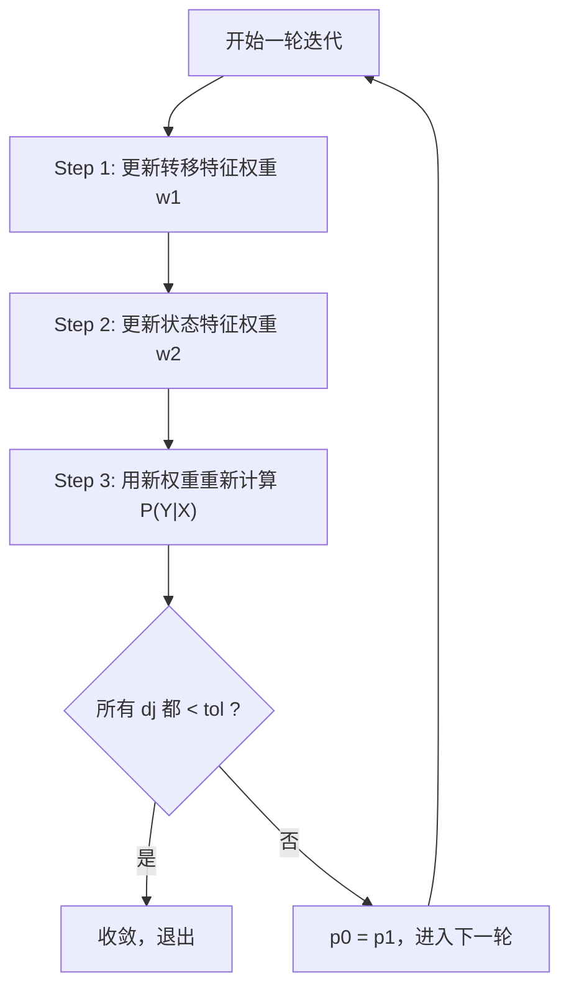

The user wants me to explain the entire IIS iteration loop. Let me break it down into clear sections.
## IIS 迭代循环完整解释

整个循环每轮做 3 件事：**①更新权重 → ②重新计算模型概率 → ③判断收敛**



---

## Step 1：更新转移特征权重（第 174-197 行）

### 1.1 构建目标方程 `func(d, k)`

```174:189:h:\machine learning algorithm\machine-learning-algorithms\12crf\2IIS.py
def func(d, kk):
    res = 0
    for xxi in range(n_x):
        for yyi in range(n_y):
            val = 0
            for i in range(1, n_position):
                val += transfer_features[kk](yy[i-1], yy[i], xx, i)
            val *= d2[xxi] * p0[xxi][yyi] * pow(math.e, d * nn[xxi][yyi])
            res += val
    res -= d3[kk]
    return res
```

这个函数对应 IIS 的目标方程：

$$g_k(\delta_k) = \sum_{x,y} \tilde{P}(x) \cdot P_w(y|x) \cdot e^{\delta_k \cdot f^\#(x,y)} \cdot t_k(x,y) - E_{\tilde{P}}[t_k] = 0$$

逐项对应：

```python
val = transfer_features[kk](yy[i-1], yy[i], xx, i)   # ← tₖ(x,y) 特征值
val *= d2[xxi]                                         # ← P̃(x) 边缘经验分布
val *= p0[xxi][yyi]                                    # ← Pw(y|x) 当前模型概率
val *= pow(math.e, d * nn[xxi][yyi])                   # ← e^(δ·f#(x,y)) 增量因子
res -= d3[kk]                                           # ← 减去经验期望 EP(tₖ)
```

**目标：找到 $\delta_k$ 使得 $g_k(\delta_k) = 0$。**

### 1.2 牛顿法求解

```192:192:h:\machine learning algorithm\machine-learning-algorithms\12crf\2IIS.py
    dj = newton_method_linear(func, args=(k,))
```

把 $\delta_k$（代码中的 `d`）作为未知数，牛顿法从 0 开始搜索，找到让方程等于 0 的根。

### 1.3 更新权重

```195:197:h:\machine learning algorithm\machine-learning-algorithms\12crf\2IIS.py
    w1[k] += dj
    if abs(dj) >= tol:
        change = True
```

把增量 `dj` 加到当前权重上。如果增量很小（< `tol`），说明这个权重已经基本不需要调整了。

---

## Step 2：更新状态特征权重（第 199-222 行）

结构与 Step 1 **完全一样**，只是把：
- `transfer_features[kk]` → `state_features[ll]`
- `d3[kk]` → `d4[ll]`
- `range(1, n_position)` → `range(n_position)`

---

## Step 3：用新权重重新计算模型概率（第 224-242 行）

```224:242:h:\machine learning algorithm\machine-learning-algorithms\12crf\2IIS.py
p1 = [[0.0] * n_y for _ in range(n_x)]
for xi in range(n_x):
    for yi in range(n_y):
        res = 0
        # 用新权重计算非规范化概率
        for k in range(n_transfer_features):
            for i in range(1, n_position):
                res += w1[k] * t[k](y[i-1], y[i], x, i)
        for l in range(n_state_features):
            for i in range(n_position):
                res += w2[l] * s[l](y[i], x, i)
        p1[xi][yi] = pow(math.e, res)    # e^(score)
    # 归一化
    total = sum(p1[xi][yi] for yi in range(n_y))
    for yi in range(n_y):
        p1[xi][yi] /= total
```

这一步就是用**更新后的权重**重新计算每个 $(x, y)$ 的归一化条件概率：

$$P_w(y|x) = \frac{\exp\left(\sum w_k f_k\right)}{\sum_{y'} \exp\left(\sum w_k f_k(y', x)\right)}$$

这个新的 `p1` 会成为下一轮迭代的 `p0`。

---

## 收敛判断（第 244-247 行）

```244:247:h:\machine learning algorithm\machine-learning-algorithms\12crf\2IIS.py
if not change:
    break
p0 = p1
```

- 如果所有特征的 `|dj|` 都 < `tol`，`change` 保持 `False` → 收敛，退出循环
- 否则，`p0 = p1`，用新概率进入下一轮迭代

---

## 用具体数值理解迭代过程

```
第 0 轮开始:
  w = [0, 0, 0, 0, 0, 0, 0, 0, 0]    (全部为零)
  P = 均匀分布 (每个 y 的概率相同)

第 0 轮结束:
  模型期望 E_P[t₁] = 0.1              (均匀分布下的期望)
  数据期望 d3[0]  = 0.35              (阶段1算出来的)
  差距很大！→ dj 较大 → w 变化大

第 1 轮开始:
  w = [1.05, 0.72, ...]               (已经学到一些东西)
  P = 不再均匀 (某些 y 概率更高)

第 1 轮结束:
  模型期望 E_P[t₁] = 0.30             (接近了)
  数据期望 d3[0]  = 0.35              (不变)
  差距缩小 → dj 变小

...

第 613 轮:
  w = [1.07, 0.75, 0.75, 0.35, 1.38, 1.04, 0.22, 0.67, 0.4]
  所有 |dj| < 1e-4 → 收敛！
```

每一轮，模型预测都在**逼近训练数据中的统计规律**，直到两者几乎相等。