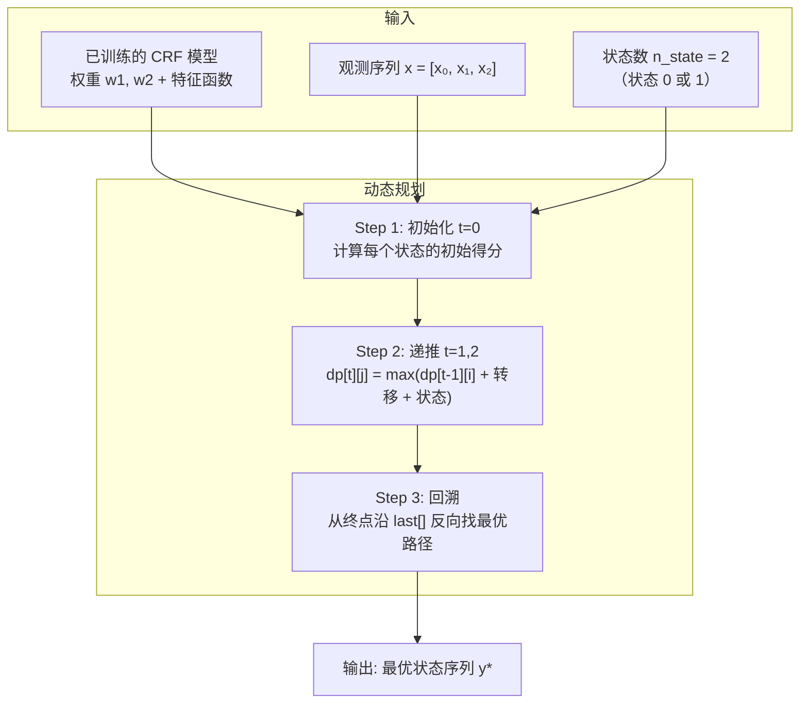

The user wants me to explain the Viterbi algorithm for CRF prediction based on the code in 4viterbi.md.py. Let me read the file first.
## 维特比算法（Viterbi Algorithm）预测状态序列

### 一句话总结

给定已训练的 CRF 模型和一个观测序列 $x$，找到**概率最大**的状态序列 $y^* = \arg\max_y P(y|x)$。

---

### 总览



---

### 数学公式

维特比算法要最大化的是非规范化概率（取 log 后变成加法）：

$$y^* = \arg\max_y \sum_k w_k f_k(y, x) = \arg\max_y \left(\sum_{t,k} w_k t_k(y_{t-1}, y_t, x, t) + \sum_{t,l} w_l s_l(y_t, x, t)\right)$$

对数域中，乘法变加法，$\max$ 代替求和（类似于 $\max$-sum 算法）。

---

### Step 1：初始化 t=0（第 20-23 行）

```20:23:h:\machine learning algorithm\machine-learning-algorithms\12crf\4viterbi.md.py
for i in range(n_state):
    for l in range(n_state_features):
        dp[0][i] += w2[l] * state_features[l](y0=i, x=x, i=0)
```

位置 0 没有前驱状态，所以**只计算状态特征**：

$$\delta_0(i) = \sum_l w_l^{(s)} \cdot s_l(y_0=i, x, 0)$$

```
位置 0:
  δ₀(0) = w2[0]·s1(0,x,0) + w2[1]·s2(0,x,0) + w2[2]·s3(0,x,0) + w2[3]·s4(0,x,0)
  δ₀(1) = w2[0]·s1(1,x,0) + w2[1]·s2(1,x,0) + w2[2]·s3(1,x,0) + w2[3]·s4(1,x,0)
```

---

### Step 2：递推 t=1,2,...（第 25-38 行）

```25:38:h:\machine learning algorithm\machine-learning-algorithms\12crf\4viterbi.md.py
for t in range(1, n_position):
    for i in range(n_state):          # 前一个状态
        for j in range(n_state):      # 当前状态
            d = dp[t-1][i]            # 从前一个状态 i 过来的得分
            for k in range(n_transfer_features):
                d += w1[k] * transfer_features[k](y0=i, y1=j, x=x, i=t)
            for l in range(n_state_features):
                d += w2[l] * state_features[l](y0=j, x=x, i=t)
            if d >= dp[t][j]:
                dp[t][j] = d          # 更新最大得分
                last[t][j] = i        # 记录最佳前驱
```

核心递推公式：

$$\delta_t(j) = \max_{i} \left[\delta_{t-1}(i) + \sum_k w_k^{(t)} t_k(i, j, x, t) + \sum_l w_l^{(s)} s_l(j, x, t)\right]$$

```
                ┌──────────────────────────────────────────┐
                │  δₜ(j) = max over i of:                  │
                │                                          │
                │  δₜ₋₁(i)     ← 到达前一个状态 i 的最佳得分  │
                │  + Σ wₖ·tₖ(i→j)  ← 从 i 转移到 j 的得分    │
                │  + Σ wₗ·sₗ(j)    ← 在 j 的状态得分          │
                └──────────────────────────────────────────┘
```

用具体例子（$n\_state=2$，位置 $t=1$）：

```
                  状态0              状态1
                 ┌─────┐           ┌─────┐
  δ₀(0)=1.5 ──→ │ ?   │  转移+状态  │ ?   │ ←── δ₀(1)=0.8
                 └─────┘           └─────┘
                 
  计算 dp[1][0]:
    从 i=0 来: d = 1.5 + 转移(0→0) + 状态(0) = 2.3
    从 i=1 来: d = 0.8 + 转移(1→0) + 状态(0) = 1.6
    max = 2.3 → dp[1][0] = 2.3, last[1][0] = 0
    
  计算 dp[1][1]:
    从 i=0 来: d = 1.5 + 转移(0→1) + 状态(1) = 2.8
    从 i=1 来: d = 0.8 + 转移(1→1) + 状态(1) = 1.5
    max = 2.8 → dp[1][1] = 2.8, last[1][1] = 0
```

---

### Step 3：找终点（第 40-44 行）

```40:44:h:\machine learning algorithm\machine-learning-algorithms\12crf\4viterbi.md.py
best_end, best_gamma = 0, 0
for i in range(n_state):
    if dp[-1][i] > best_gamma:
        best_end, best_gamma = i, dp[-1][i]
```

在最后一个位置，选得分最大的状态作为终点。

```
位置 2:  dp[2][0] = 3.1,  dp[2][1] = 2.5
                      ↓
         best_end = 0,  best_gamma = 3.1
```

---

### Step 4：回溯路径（第 46-49 行）

```46:49:h:\machine learning algorithm\machine-learning-algorithms\12crf\4viterbi.md.py
ans = [0, 0, best_end]
for t in range(n_position - 1, 0, -1):
    ans[t-1] = last[t][ans[t]]
```

从终点**反向回溯**，利用 `last` 数组找每一步的最佳前驱。

```
回溯过程:
  t=2: ans[2] = 0 (best_end)
  t=2: ans[1] = last[2][0] = 1  → 前一个状态是 1
  t=1: ans[0] = last[1][1] = 0  → 前一个状态是 0
  
最优路径: [0, 1, 0]
```

```mermaid
flowchart LR
    t0["t=0<br/>状态 0<br/>δ=1.5"] -->|last[1][1]=0| t1["t=1<br/>状态 1<br/>δ=2.8"]
    t1 -->|last[2][0]=1| t2["t=2<br/>状态 0<br/>δ=3.1 ✓"]
    
    style t2 fill:#6f9,stroke:#333
```

---

### DP 表格可视化

以 $x=[1,0,1]$, $n\_state=2$ 为例：

```
            状态 0       状态 1
         ┌──────────┬──────────┐
  t=0    │  δ=1.5   │  δ=0.8   │  ← 初始化（只有状态特征）
         │  last=-  │  last=-  │
         ├──────────┼──────────┤
  t=1    │  δ=2.3   │  δ=2.8   │  ← δ₀(0)+转移(0→0)+状态(0) = 2.3
         │  last=0  │  last=0  │     δ₀(0)+转移(0→1)+状态(1) = 2.8 ← max
         ├──────────┼──────────┤
  t=2    │  δ=3.1   │  δ=2.5   │  ← δ₁(1)+转移(1→0)+状态(0) = 3.1 ← max
         │  last=1  │  last=1  │
         └──────────┴──────────┘
                    ↑
              best_end = 0

回溯:  t=2→0,  t=1→1,  t=0→0
最优路径: [0, 1, 0]
```

---

### 两个矩阵的作用

| 矩阵 | 大小 | 含义 |
|---|---|---|
| `dp[t][j]` | $n\_position \times n\_state$ | 到达位置 $t$ 状态 $j$ 的**最大得分** |
| `last[t][j]` | $n\_position \times n\_state$ | 到达位置 $t$ 状态 $j$ 时，**前一个最佳状态**是谁 |

`dp` 用于向前计算最优得分，`last` 用于向后回溯最优路径。两者配合，这就是**动态规划**的精髓。

---

### 在 CRF 三大问题中的位置

| 问题 | 算法 | 目的 |
|---|---|---|
| **概率计算** | 前向-后向算法 | 给定 $x, y$，算 $P(y\|x)$ |
| **学习** | IIS / BFGS | 给定训练数据，学权重 $w$ |
| **预测（本文件）** | **维特比算法** | 给定 $x$，找最优 $y^*$ |