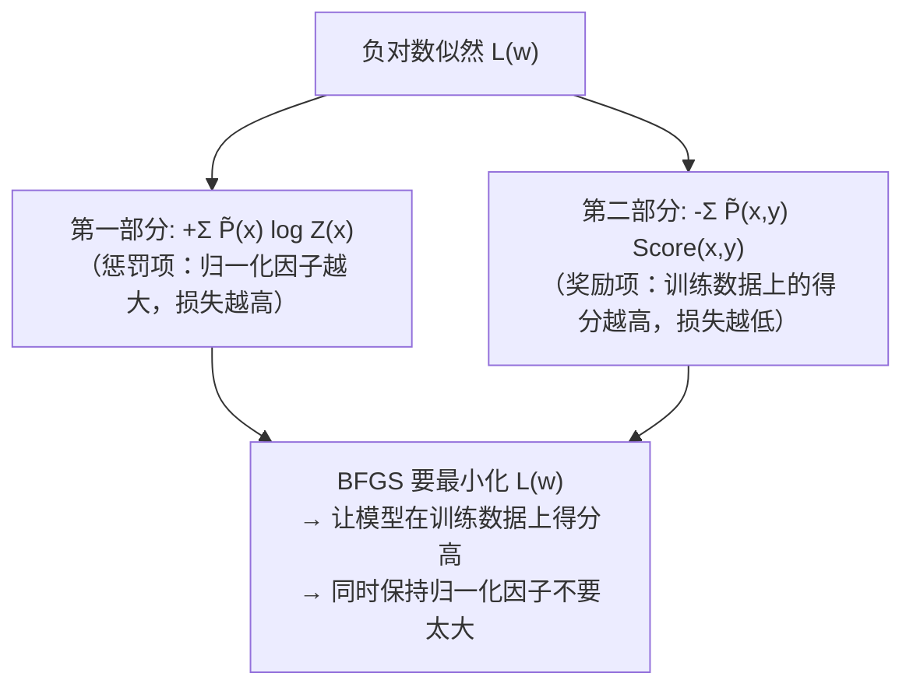

The user wants to know what BFGS is. Let me explain it clearly.
## BFGS 算法

### 一句话总结

BFGS 是一种**无约束优化算法**，用于找到多元函数的极小值点，属于**拟牛顿法**家族。

---

### 名字由来

BFGS 是四位发明者的姓氏首字母：

| 字母 | 人物 | 年份 |
|---|---|---|
| **B** | Broyden | 1970 |
| **F** | Fletcher | |
| **G** | Goldfarb | |
| **S** | Shanno | |

他们几乎同时独立提出了这个算法。

---

### 它要解决什么问题？

给定一个多元函数 $f(w_1, w_2, \dots, w_n)$，找到让 $f$ 最小的 $w^*$：

$$w^* = \arg\min_w f(w)$$

在 CRF 中，$f(w)$ 就是负对数似然函数，$w$ 是 9 个权重。

---

### 从梯度下降到牛顿法到 BFGS


#### 1. 梯度下降

$$w_{k+1} = w_k - \alpha \cdot \nabla f(w_k)$$

- 只用**一阶导数**（梯度）
- 优点：简单、便宜（只需计算梯度）
- 缺点：收敛慢，走"之字形"

#### 2. 牛顿法

$$w_{k+1} = w_k - H^{-1}(w_k) \cdot \nabla f(w_k)$$

- 用**二阶导数**（Hessian 矩阵 $H$）
- 优点：收敛快（二次收敛）
- 缺点：计算 $H^{-1}$ 太贵（$n \times n$ 矩阵求逆，$O(n^3)$）

#### 3. BFGS（拟牛顿法）

$$w_{k+1} = w_k - B_k^{-1} \cdot \nabla f(w_k)$$

- 不直接计算 Hessian，而是用**一阶信息逐步逼近** $H^{-1}$
- 用矩阵 $B_k$ 来**近似** $H(w_k)$
- 每轮迭代用简单公式更新 $B_k$，无需计算二阶导数

---

### BFGS 的迭代流程

```
初始化: w₀, B₀ = I（单位矩阵）

重复:
  1. 计算梯度 gₖ = ∇f(wₖ)
  2. 计算搜索方向 pₖ = -Bₖ⁻¹ · gₖ
  3. 一维搜索找最优步长 λₖ（黄金分割法）
  4. 更新位置  wₖ₊₁ = wₖ + λₖ · pₖ
  5. 计算新梯度 gₖ₊₁ = ∇f(wₖ₊₁)
  6. 计算 yₖ = gₖ₊₁ - gₖ,  dₖ = wₖ₊₁ - wₖ
  7. 更新近似矩阵 Bₖ₊₁ = BFGS公式(yₖ, dₖ, Bₖ)

直到 |gₖ| < tol
```

对应代码中的关键行：

| 步骤 | 代码行 | 说明 |
|---|---|---|
| 1 | `nabla = partial_derivative(func, w0)` | 计算梯度 |
| 2 | `pk = - np.linalg.solve(B0, g0)` | 计算搜索方向 |
| 3 | `lk = golden_section_for_line_search(f, 0, 20)` | 黄金分割法找步长 |
| 4 | `w1 = [w0[j] + lk * pk[j,0] for j in range(...)]` | 更新位置 |
| 6 | `yk = g1 - g0`, `dk = ...` | 计算变化量 |
| 7 | `B1 = B0 + (yk@yk.T)/(yk.T@dk) + ...` | BFGS 更新公式 |

---

### BFGS 更新公式

```282:282:h:\machine learning algorithm\machine-learning-algorithms\12crf\3Quasi-Newton Methods.py
B1 = B0 + (yk @ yk.T) / (yk.T @ dk).item() + (B0 @ dk @ dk.T @ B0) / (dk.T @ B0 @ dk).item()
```

这是 BFGS 的核心——用一阶信息（梯度变化 $y_k$ 和位置变化 $d_k$）更新 Hessian 近似：

$$B_{k+1} = B_k + \frac{y_k y_k^T}{y_k^T d_k} + \frac{B_k d_k d_k^T B_k}{d_k^T B_k d_k}$$

---

### 对比总结

| | 梯度下降 | 牛顿法 | BFGS |
|---|---|---|---|
| 使用的信息 | 一阶导数 | 二阶导数 | 一阶导数近似二阶 |
| 每轮计算量 | $O(n)$ | $O(n^3)$ | $O(n^2)$ |
| 收敛速度 | 线性 | 二次 | 超线性 |
| 在 CRF 例中迭代次数 | — | — | **15 轮** |
| 缺点 | 慢、震荡 | 计算太贵 | 需存储 $n \times n$ 矩阵 |

BFGS 是实际工程中最常用的无约束优化算法之一，scipy 中的 `minimize(method='BFGS')` 就是它。


The user wants me to explain the objective function `func` in the BFGS algorithm. This is the CRF negative log-likelihood function.
## 目标函数：CRF 的负对数似然函数

### 数学公式

BFGS 要**最小化**的目标函数是：

$$L(w) = -\sum_{x} \tilde{P}(x) \log Z_w(x) + \sum_{x,y} \tilde{P}(x,y) \cdot \text{Score}_w(x,y)$$

其中：
- $Z_w(x) = \sum_y \exp(\text{Score}_w(x,y))$ 是归一化因子
- $\text{Score}_w(x,y) = \sum_k w_k f_k(x,y)$ 是特征得分

展开就是：

$$L(w) = \underbrace{\sum_x \tilde{P}(x) \log \sum_y e^{\sum_k w_k f_k(x,y)}}_{\text{第一部分（第186-204行）}} - \underbrace{\sum_{x,y} \tilde{P}(x,y) \sum_k w_k f_k(x,y)}_{\text{第二部分（第206-220行）}}$$

---

### 第一部分：归一化项（第 186-204 行）

```188:204:h:\machine learning algorithm\machine-learning-algorithms\12crf\3Quasi-Newton Methods.py
res = 0
for xxi in range(n_x):
    xx = x_list[xxi]
    t1 = 0
    for yyi in range(n_y):
        yy = y_list[yyi]
        t2 = 0
        for kk in range(n_transfer_features):
            for i in range(1, n_position):
                if transfer_features[kk](yy[i-1], yy[i], xx, i):
                    t2 += ww[kk]
        for ll in range(n_state_features):
            for i in range(n_position):
                if state_features[ll](yy[i], xx, i):
                    t2 += ww[ll + n_transfer_features]
        t1 += pow(math.e, t2)
    res += d2[xxi] * math.log(t1, math.e)
```

逐步对应：

```python
t2 = 0
# 遍历所有特征，计算 Score_w(x, y) = Σ wk · fk(x, y)
if transfer_features[kk](yy[i-1], yy[i], xx, i):
    t2 += ww[kk]                          # ← w_k · f_k（特征激活时加权重）
# ... 同理状态特征

t1 += pow(math.e, t2)
# ← Σ_y e^(Score) 就是 Z(x) 归一化因子

res += d2[xxi] * math.log(t1)
# ← P̃(x) · log Z(x)
```

用表格总结：

| 变量 | 公式 | 含义 |
|---|---|---|
| `t2` | $\sum_k w_k f_k(x, y)$ | 当前 $(x, y)$ 对的特征得分 |
| `pow(math.e, t2)` | $e^{\text{Score}}$ | 非规范化概率 |
| `t1` | $\sum_y e^{\text{Score}}$ | $Z(x)$ 归一化因子 |
| `d2[xxi] * log(t1)` | $\tilde{P}(x) \cdot \log Z(x)$ | 归一化项 |
| `res`（第一部分） | $\sum_x \tilde{P}(x) \log Z(x)$ | 归一化项总和 |

---

### 第二部分：经验得分项（第 206-220 行）

```206:220:h:\machine learning algorithm\machine-learning-algorithms\12crf\3Quasi-Newton Methods.py
for xxi in range(n_x):
    xx = x_list[xxi]
    for yyi in range(n_y):
        yy = y_list[yyi]
        t3 = 0
        for kk in range(n_transfer_features):
            for i in range(1, n_position):
                if transfer_features[kk](yy[i-1], yy[i], xx, i):
                    t3 += ww[kk]
        for ll in range(n_state_features):
            for i in range(n_position):
                if state_features[ll](yy[i], xx, i):
                    t3 += ww[ll + n_transfer_features]
        res -= d1[xxi][yyi] * t3
```

| 变量 | 公式 | 含义 |
|---|---|---|
| `t3` | $\sum_k w_k f_k(x, y)$ | 同上，特征得分 |
| `d1[xxi][yyi]` | $\tilde{P}(x, y)$ | 训练数据中的联合经验分布 |
| `d1 * t3` | $\tilde{P}(x,y) \cdot \sum w_k f_k$ | 加权经验得分 |
| `res -= ...` | 减号 | 因为是**负**对数似然 |

---

### 两部分的关系



**直觉理解**：
- 第二部分鼓励模型给训练数据中的 $(x, y)$ 对打高分
- 第一部分防止模型给所有 $(x, y)$ 都打高分（否则 $Z(x)$ 会很大）
- 两者平衡，模型才会学到**有区分度**的权重

---

### 与 IIS 的对比

| | IIS | BFGS |
|---|---|---|
| 优化方式 | 每次固定其他权重，逐个求解方程 | 直接对整个目标函数做梯度下降 |
| 是否需要目标函数 | 否（只需特征期望） | 是（需要 $L(w)$ 和 $\nabla L(w)$）|
| 收敛速度 | 慢（613 轮） | 快（15 轮） |
| 通用性 | 只适用于 CRF 的 IIS | 适用于任何可微优化问题 |