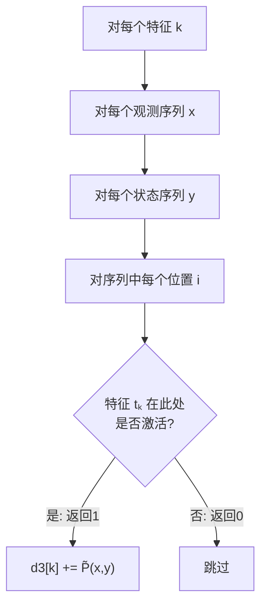

The user wants me to explain this section of code that computes the empirical expectation of transition features.
## 计算转移特征的经验期望 $E_{\tilde{P}}[t_k]$

### 数学公式

$$E_{\tilde{P}}[t_k] = \sum_{x, y} \tilde{P}(x, y) \cdot \sum_{i=1}^{n} t_k(y_{i-1}, y_i, x, i)$$

用大白话说：**某个特征在训练数据中被激活的频率有多高。**

---

### 逐层循环解释



#### 第 1 层：`for k` — 遍历每个特征

有 5 个转移特征 $t_1 \sim t_5$，分别计算各自的经验期望。

#### 第 2、3 层：`for xi, for yi` — 遍历所有 $(x, y)$ 组合

遍历训练数据中出现过的所有观测序列和状态序列的笛卡尔积。

#### 第 4 层：`for i` — 遍历序列中的每个位置

检查特征在这个 $(x, y)$ 对的**每个位置**是否被激活。

#### 核心：`if transfer_features[k](...)` — 特征是否激活

```136:146:h:\machine learning algorithm\machine-learning-algorithms\12crf\2IIS.py
    for k in range(n_transfer_features):
        for xi in range(n_x):
            for yi in range(n_y):
                x = x_list[xi]
                y = y_list[yi]
                n_position = len(x_list[xi])
                for i in range(1, n_position):
                    if transfer_features[k](y[i-1], y[i], x, i):
                        d3[k] += d1[xi][yi]   # 累加经验期望
                        nn[xi][yi] += 1       # 累加特征计数
```

---

### 具体数值例子

假设：
- 训练集有 1000 个样本
- 其中 $(x, y) = ((0,1,1), (0,0,0))$ 出现了 200 次 → $d1[0][0] = 0.2$
- 特征 $t_1$ 在这个 $(x, y)$ 对的位置 1 和位置 2 都被激活

那么对 $t_1$ 的贡献：

```
位置 i=1: t1(y[0]=0, y[1]=0, x=(0,1,1), i=1) → 0 (y1=0≠1, 不满足)
位置 i=2: t1(y[1]=0, y[2]=0, x=(0,1,1), i=2) → 0 (y1=0≠1, 不满足)
```

这个例子中 $t_1$ 没有被激活。换一个 $y = (0, 1, 0)$：

```
位置 i=1: t1(y[0]=0, y[1]=1, x=(0,1,1), i=1) → 1 ✓ (y0=0, y1=1, x[0]=0, i=1)
位置 i=2: t1(y[1]=1, y[2]=0, x=(0,1,1), i=2) → 0 (y1=0≠1)
```

位置 1 激活了一次，如果这个 $(x, y)$ 对的经验概率是 0.15，则 $d3[0] += 0.15$。

---

### `d3[k]` 和 `nn[xi][yi]` 的区别

| 变量 | 含义 | 用途 |
|---|---|---|
| `d3[k]` | 特征 $k$ 的**经验期望值**（一个标量） | IIS 目标方程中的目标值 |
| `nn[xi][yi]` | $(x_i, y_i)$ 对中**所有特征被激活的总次数**（一个矩阵） | IIS 迭代中计算 $e^{d \cdot f^\#(x,y)}$ |

`nn` 的计算逻辑是：不管是哪个特征 $k$ 或 $l$ 被激活，只要激活了就 +1，所以它统计的是**每个 $(x, y)$ 对的总特征激活数**。